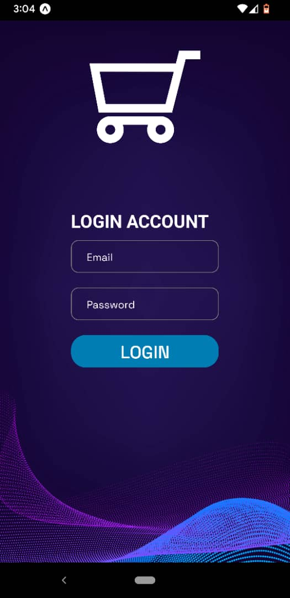

<!-- ⚠️ This README has been generated from the file(s) "blueprint.md" ⚠️-->

# ➤ AUTHENTICATION WORK-FLOW

  

## ➤ Table Of Content

- [Description](#description)
- [Deployed website link](#deployedWebsite)
- [Installation](#installation)
- [Usage](#usage)
- [Contributing](#contribution)
- [Tests](#tests)
- [GitHub](#github)
- [Contact](#contact)
- [License](#license)

  

## ➤ Description

 What was your motivation?
My motivation for this project stemmed from the need to understand and implement authentication workflows in React Native applications. Authentication is a fundamental aspect of many mobile apps, and I wanted to gain practical experience in handling user authentication securely and efficiently.

Why did you build this project?
I built this project to deepen my knowledge of authentication mechanisms such as email/password authentication and social media logins (e.g., Google, Facebook) within the context of a React Native mobile app. By building a practical authentication workflow, I aimed to enhance my skills in front-end development and user authentication practices.

What problem does it solve?
This project addresses the need for a robust and user-friendly authentication system in mobile applications. By implementing authentication features, users can securely create accounts, log in, and access personalized content or features within the app. This helps in enhancing user experience, maintaining data privacy, and preventing unauthorized access.

What did you learn?
Through this project, I learned:

How to integrate authentication libraries or APIs in React Native projects.
Best practices for user authentication, such as password hashing, token-based authentication, and secure storage of user credentials.
Handling different authentication scenarios, including user registration, login, logout, password recovery, and social authentication.
User interface design considerations for authentication screens, such as login/signup forms, validation, and error handling.
Testing and debugging authentication flows to ensure reliability and security.
Importance of implementing security measures like HTTPS, session management, and secure token handling to protect user data.

Deployed website: <strong><a href="https://911samuel.github.io/authentication/">https://911samuel.github.io/authentication/</a></strong>

  <div">
     
    
Mobile view of Home screen of the app

  

  

     
    
Mobile view of Signup screen of the app

  

  

     
    
Mobile view of Login screen of the app

  

## ➤ Installation

To install and use the README Generator, follow these step-by-step instructions:Clone the GitHub repository: Start by cloning the GitHub repository to your local machine using the command:git clone https://github.com/AntonScheving/README-Generator.gitInstall Node.js: If you don't have Node.js installed on your machine, download and install it from the official website: https://nodejs.org/en/.Install dependencies: Navigate to the project directory in your terminal and run the following command to install the required dependencies:npm install --save inquirer fsRun the generator: To run the README Generator, run the following command in your terminal:node index.jsAnswer the prompts in the terminal: The generator will prompt you with a series of questions about your project. Answer each question as accurately as possible. See the Usage section to learn how to answer long-form questions.Generate README.md file: Once you have answered all the questions, the generator will generate the README.md file based on your answers. The generated file will be saved in the project directory.Review and edit the generated README.md file: Review the generated README.md file and make any necessary edits or additions to ensure that it accurately represents your project and provides all the necessary information.That's it! With these steps, you can generate a professional-looking README.md file for your project with minimal effort.README Generator is built with the following tools and libraries:JavaScriptNode.jsnpm packages - inquirer & fsMarkdown

AUTHENTICATION WORK-FLOW is built with the following tools and libraries: <ul><li>React Native</li><li>Expo</li><li>expo/metro-runtime</li><li>expo-google-fonts/space-grotesk</li></ul>

## ➤ Usage
 
Usage Instructions:
1. Install the dependencies using 'npm install'.
2. Start the development server with 'npm start'.
3. Navigate to http://localhost:3000 in your browser to see the application.

Functionality Overview:
- Login: Allows users to log in to their accounts.
- Dashboard: Displays user data and statistics.
- Settings: Provides options to customize user preferences.

Code Examples:
// Example code snippet demonstrating usage of a function
const fetchData = async () => {
  // Fetch data from API endpoint
  const response = await fetch('https://api.example.com/data');
  const data = await response.json();
  return data;
};

Usage Scenarios:
- Scenario 1: User logs in and views their dashboard.
- Scenario 2: User updates their profile settings.

## ➤ Contribution

 Contribution Guidelines:
- Fork the repository and create a new branch for your contributions.
- Follow the coding style and conventions specified in the project.
- Write clear commit messages and comments to explain your changes.
- Submit a pull request detailing the changes made and why they are beneficial.
- Ensure your code passes all tests and does not introduce new issues.

Issue Reporting:
- Use descriptive titles and provide steps to reproduce the issue.
- Include screenshots or error messages if applicable.
- Check if the issue has already been reported before creating a new one.

Feature Requests:
- Describe the proposed feature or enhancement in detail.
- Explain why the feature would be beneficial to the project.

Code Reviews:
- Participate in code reviews to provide feedback and suggestions to other contributors.
- Be respectful and constructive in your comments and feedback.

By following these guidelines, we can maintain a collaborative and high-quality codebase for everyone.

## ➤ Tests
 
Test Instructions:
1. Install testing dependencies using 'npm install --dev'.
2. Run unit tests using 'npm test'.
3. Verify that each component/module functions correctly under normal conditions.
4. Test edge cases and boundary conditions to ensure robustness.
5. Check for error handling and proper error messages.
6. Test user interactions and interfaces for usability and accessibility.
7. Perform integration tests to validate interactions between components/modules.
8. Report any test failures or unexpected behavior using the project's issue tracker.

By following these test instructions, we can ensure the quality and reliability of our project's functionality.

## ➤ GitHub

<a href="https://github.com/911samuel."><strong>911samuel.</a></strong>

Visit my website: <strong><a href="https://911samuel.github.io/authentication/">authentication</a></strong>

## ➤ Contact

Feel free to reach out to me on my email:
abayizeraeaz@gmail.com

## ➤ License

